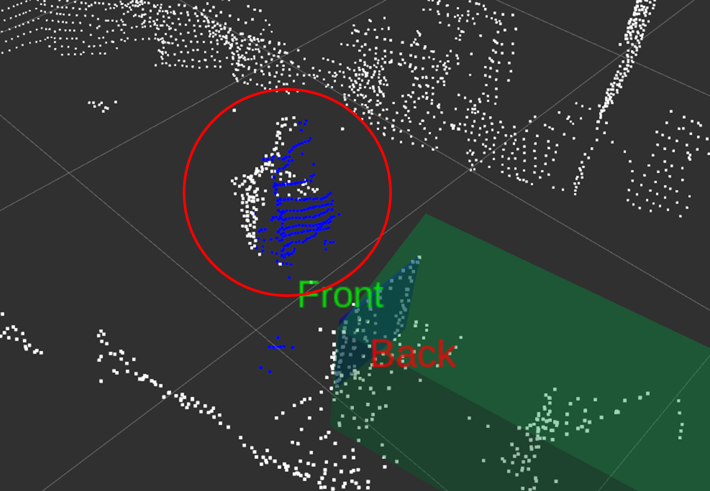
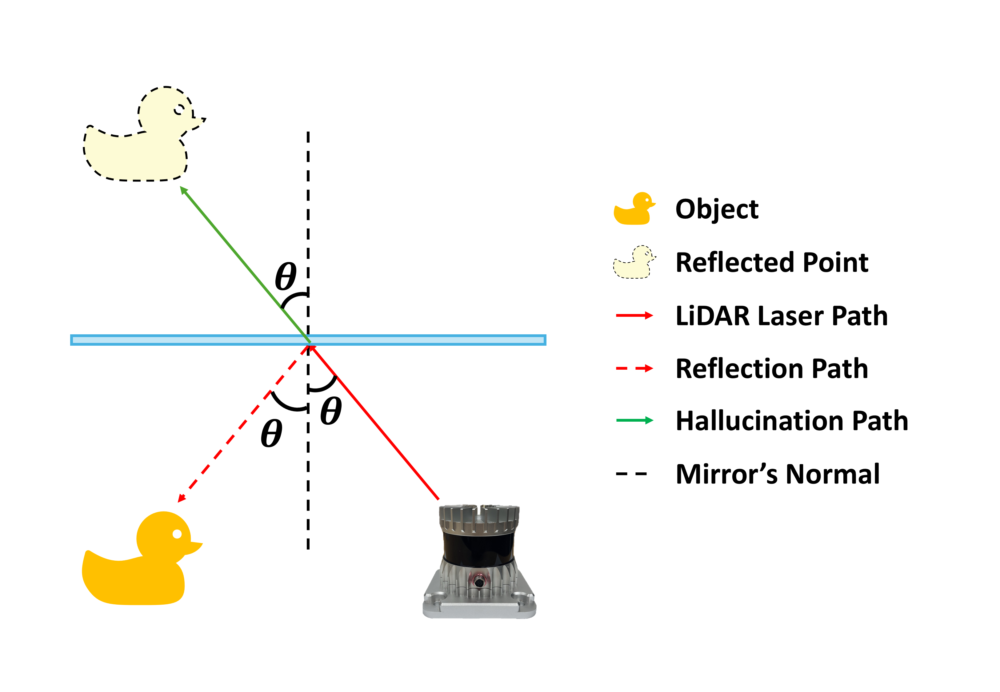
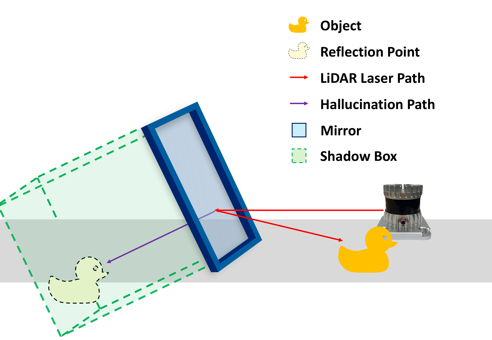
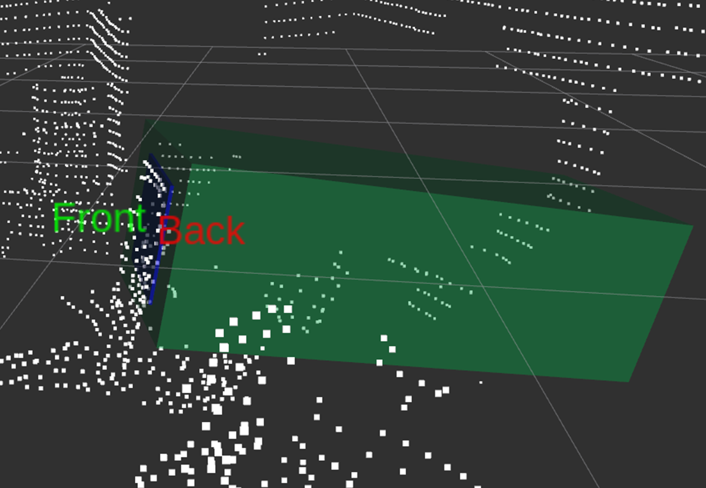
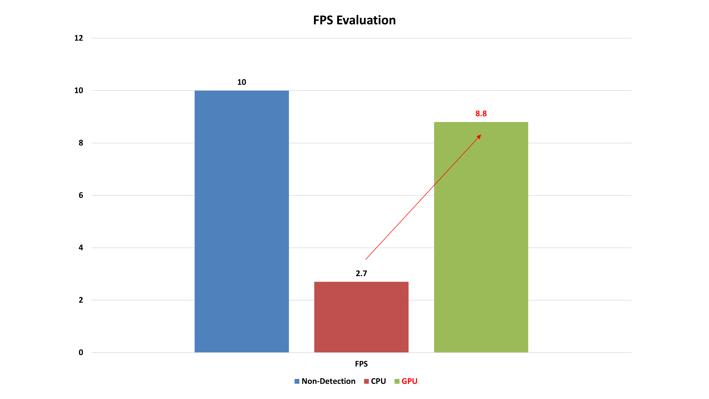

# LiDAR Reflection Recovery via Shadow Boxing
<table>
  <tr>
    <td align="center">
      
    </td>
    <td align="center">
      
    </td>
  </tr>
</table>

- This is my first paper accepted in ICTC 2025!
- You can see full paper in "NSL" website!
    - https://nsl.cau.ac.kr/papers/ictc/ictc2025-kim-lidar-mirror.pdf

## Problem

  

- LiDAR sensors are vulnerable to reflective surfaces such as mirrors or glass.

- When a laser reflected by a mirror hits another object, the sensor incorrectly assumes the laser traveled straight through, generating a "hallucination" point cloud behind the mirror.

- This distorted 3D data can cause severe errors in object recognition and SLAM mapping for autonomous driving and robotics.

## Method

  

- Mirror Detection: Utilizes the LiDAR's Dual Return feature (based on Ouster OS1-32). Dense Second Return points generated on the mirror surface are clustered using the DBSCAN algorithm. Then, a PCA-based planarity check and the RANSAC algorithm are applied to accurately identify the mirror plane.

- Shadow Boxing: Creates a virtual bounding box (Shadow Box) behind the mirror along the laser path, sized according to the mirror's dimensions, to effectively filter and classify normal points versus reflected points.

- Point Recovery: Restores the classified reflected points to their original 3D locations using the Householder Transformation. It additionally corrects the Z-axis tilt distortion caused by the mirror's inclination.

- GPU Acceleration: Implements parallel computing and GPU acceleration using Open3D tensors and PyTorch to meet real-time processing requirements.

## Results
<table>
  <tr>
    <td align="center">
      
    </td>
    <td align="center">
      
    </td>
  </tr>
</table>

- Successfully recovered point clouds for the occluded rear and side surfaces of various target objects (air purifier, duck doll, person) that the LiDAR cannot normally detect.

- Demonstrated stable object detection via mirror reflection even under occlusion, where the sensor's direct line of sight is obstructed.

- Achieved a real-time processing speed of 8.8 FPS with GPU acceleration, marking an approximate 3.2x performance improvement over the CPU-only baseline (2.7 FPS).

## Execution
- Soon!

## Conference Info
The 16th International Conference on Information and Communication Technology Convergence (ICTC) - ICTC Workshop on Big Data, CPS, and 5G&6G Communication Networks (IWBCN)